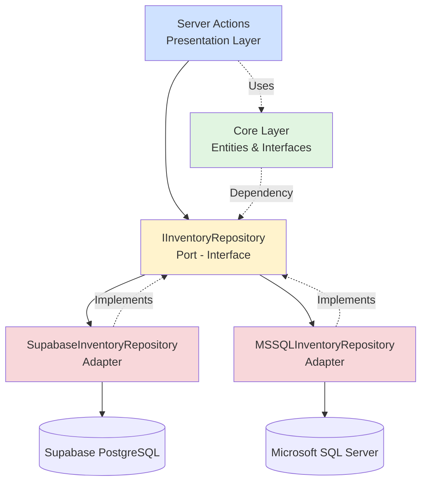

# Repository Pattern Implementation - Complete Summary

## 📚 Overview

This document provides a comprehensive summary of the **Repository Pattern** implementation for the WMSCPP project, following **Clean Architecture** principles.

---

## 🏗️ Architecture



---

## 📁 Project Structure

```
src/
├── core/                           # 🟢 Core Layer (Pure TypeScript)
│   ├── entities/
│   │   ├── Product.ts             # Domain entity
│   │   ├── TransactionLog.ts      # Transaction types & result wrappers
│   │   └── index.ts               # Barrel export
│   ├── interfaces/
│   │   ├── IInventoryRepository.ts # Repository contract (Port)
│   │   └── index.ts
│   └── index.ts                    # Master export
│
├── infrastructure/                 # 🔴 Infrastructure Layer (Adapters)
│   ├── repositories/
│   │   ├── SupabaseInventoryRepository.ts  # Supabase implementation
│   │   ├── MSSQLInventoryRepository.ts     # MSSQL implementation
│   │   └── index.ts
│   └── index.ts
│
└── actions/                        # 🔵 Presentation Layer
    └── product-inventory-actions.ts # Server Actions using repositories
```

---

## 🎯 Core Entities

### 1. **Product Entity** ([Product.ts](file:///c:/Users/nteai/Desktop/project/WMSCPP/src/core/entities/Product.ts))

```typescript
export interface Product {
  sku: string; // Stock Keeping Unit
  name: string; // Product name
  qty: number; // Current quantity in stock
  location: string; // Storage location code
  batchNo: string; // Batch number for traceability
}
```

### 2. **TransactionLog Entity** ([TransactionLog.ts](file:///c:/Users/nteai/Desktop/project/WMSCPP/src/core/entities/TransactionLog.ts))

```typescript
export enum TransactionType {
  ADJUSTMENT = 'ADJUSTMENT',
  INBOUND = 'INBOUND',
  OUTBOUND = 'OUTBOUND',
  TRANSFER = 'TRANSFER',
  STOCKTAKE = 'STOCKTAKE',
}

export interface TransactionLog {
  sku: string;
  type: TransactionType;
  qtyChange: number;
  fromLocation?: string; // Optional - for TRANSFER type
  toLocation?: string; // Optional - for TRANSFER type
  batchNo: string;
  performedBy: string;
  metadata?: Record<string, unknown>;
  timestamp: string; // ISO 8601 format
}
```

---

## 🔌 Repository Interface (Port)

### **IInventoryRepository** ([IInventoryRepository.ts](file:///c:/Users/nteai/Desktop/project/WMSCPP/src/core/interfaces/IInventoryRepository.ts))

```typescript
export interface IInventoryRepository {
  // Product Operations
  getProducts(): Promise<Product[]>;
  getProductBySku(sku: string): Promise<Product | null>;
  updateStock(sku: string, qty: number): Promise<OperationResult<Product>>;

  // Transaction Operations
  logTransaction(data: TransactionLog): Promise<OperationResult<TransactionLog>>;
  getTransactionHistory(sku: string, limit?: number): Promise<TransactionLog[]>;

  // Stock Transfer
  transferStock(
    sku: string,
    fromLocation: string,
    toLocation: string,
    qty: number,
    performedBy: string,
  ): Promise<OperationResult<TransactionLog>>;
}
```

---

## 🔧 Infrastructure Implementations

### 1. **Supabase Adapter** ([SupabaseInventoryRepository.ts](file:///c:/Users/nteai/Desktop/project/WMSCPP/src/infrastructure/repositories/SupabaseInventoryRepository.ts))

**Purpose:** Main database for the application (PostgreSQL via Supabase)

**Usage Example:**

```typescript
import { createClient } from '@/lib/supabase/server';
import { SupabaseInventoryRepository } from '@/infrastructure/repositories';

const supabase = await createClient();
const repo = new SupabaseInventoryRepository(supabase);
const products = await repo.getProducts();
```

**Key Features:**

- ✅ Full CRUD operations
- ✅ RLS (Row-Level Security) support
- ✅ Transaction logging
- ✅ Stock transfers

---

### 2. **MSSQL Adapter** ([MSSQLInventoryRepository.ts](file:///c:/Users/nteai/Desktop/project/WMSCPP/src/infrastructure/repositories/MSSQLInventoryRepository.ts))

**Purpose:** Legacy ERP integration (Microsoft SQL Server)

**Usage Example:**

```typescript
import { MSSQLInventoryRepository } from '@/infrastructure/repositories';

const mssqlRepo = new MSSQLInventoryRepository();
const erpProducts = await mssqlRepo.getProducts();
```

**Key Features:**

- ✅ Connection pooling
- ✅ Read operations from ERP
- ✅ Parameterized queries (SQL injection prevention)
- ✅ Graceful connection management

---

## Server Actions (Presentation Layer)

### **product-inventory-actions.ts** ([View File](file:///c:/Users/nteai/Desktop/project/WMSCPP/src/actions/product-inventory-actions.ts))

**Available Actions:**

1. **`getProductsAction()`** - Fetch all products
2. **`getProductBySkuAction(sku)`** - Fetch single product
3. **`updateStockAction(sku, qty)`** - Update stock quantity
4. **`transferStockAction(...)`** - Transfer stock between locations
5. **`getTransactionHistoryAction(sku, limit)`** - Get transaction logs
6. **`syncProductsFromERPAction()`** - Sync data from MSSQL to Supabase

**Example Usage in Components:**

```typescript
import { getProductsAction } from '@/actions/product-inventory-actions';

export default async function InventoryPage() {
  const result = await getProductsAction();

  if (!result.success) {
    return <div>Error: {result.message}</div>;
  }

  return <ProductList products={result.data.products} />;
}
```

---

## 🌐 Environment Variables

### Required Configuration (`.env.local`)

```bash
# ===========================
# Supabase Configuration
# ===========================
NEXT_PUBLIC_SUPABASE_URL=https://your-project.supabase.co
NEXT_PUBLIC_SUPABASE_ANON_KEY=eyJhbGc...
SUPABASE_SERVICE_ROLE_KEY=eyJhbGciOiJ...

# ===========================
# MSSQL Configuration
# ===========================
MSSQL_SERVER=your-server.database.windows.net
MSSQL_PORT=1433
MSSQL_DATABASE=your_database_name
MSSQL_USER=your_username
MSSQL_PASSWORD=your_password
MSSQL_ENCRYPT=true
MSSQL_TRUST_SERVER_CERTIFICATE=false
```

> 💡 See [.env.example](file:///c:/Users/nteai/Desktop/project/WMSCPP/.env.example) for complete configuration

---

## ✅ Benefits of This Architecture

### 1. **Testability**

```typescript
// Easy to mock repositories in tests
const mockRepo: IInventoryRepository = {
  getProducts: jest.fn().mockResolvedValue([]),
  // ... other methods
};
```

### 2. **Flexibility**

Switch between databases without changing business logic:

```typescript
// Development: Use Supabase
const repo = new SupabaseInventoryRepository(supabase);

// Production: Use MSSQL for specific features
const repo = new MSSQLInventoryRepository();
```

### 3. **Maintainability**

- **Core Layer:** Pure TypeScript, no framework dependencies
- **Infrastructure Layer:** Database-specific implementations
- **Presentation Layer:** Server Actions remain clean and simple

### 4. **Type Safety**

All operations are strictly typed with TypeScript:

```typescript
const result: OperationResult<Product> = await repo.updateStock('SKU-001', 50);
if (result.success) {
  console.log(result.data.qty); // TypeScript knows this is a Product
}
```

---

## 🚀 Next Steps

### 1. **Database Schema Requirements**

For Supabase, create these tables:

```sql
-- Products table
CREATE TABLE products (
  sku VARCHAR PRIMARY KEY,
  name VARCHAR NOT NULL,
  qty INTEGER NOT NULL DEFAULT 0,
  location VARCHAR NOT NULL,
  batch_no VARCHAR NOT NULL,
  created_at TIMESTAMP DEFAULT NOW(),
  updated_at TIMESTAMP DEFAULT NOW()
);

-- Transaction logs table
CREATE TABLE transaction_logs (
  id UUID PRIMARY KEY DEFAULT uuid_generate_v4(),
  sku VARCHAR NOT NULL REFERENCES products(sku),
  type VARCHAR NOT NULL,
  qty_change INTEGER NOT NULL,
  from_location VARCHAR,
  to_location VARCHAR,
  batch_no VARCHAR NOT NULL,
  performed_by VARCHAR NOT NULL,
  metadata JSONB,
  timestamp TIMESTAMP NOT NULL DEFAULT NOW()
);

-- Indexes
CREATE INDEX idx_transaction_logs_sku ON transaction_logs(sku);
CREATE INDEX idx_transaction_logs_timestamp ON transaction_logs(timestamp DESC);
```

### 2. **Add Unit Tests**

```typescript
// test/infrastructure/SupabaseInventoryRepository.test.ts
describe('SupabaseInventoryRepository', () => {
  it('should fetch all products', async () => {
    const mockSupabase = createMockSupabaseClient();
    const repo = new SupabaseInventoryRepository(mockSupabase);

    const products = await repo.getProducts();
    expect(products).toHaveLength(2);
  });
});
```

### 3. **Add Validation Layer (Optional)**

Use Zod for runtime validation:

```typescript
import { z } from 'zod';

const ProductSchema = z.object({
  sku: z.string().min(1),
  name: z.string().min(1),
  qty: z.number().int().min(0),
  location: z.string().min(1),
  batchNo: z.string().min(1),
});

export function validateProduct(data: unknown): Product {
  return ProductSchema.parse(data);
}
```

---

## 📊 Comparison: Before vs After

### **Before (Tightly Coupled)**

```typescript
export async function getProducts() {
  const supabase = await createClient();
  const { data } = await supabase.from('products').select('*');
  return data; // Locked to Supabase
}
```

### **After (Repository Pattern)**

```typescript
export async function getProducts() {
  const supabase = await createClient();
  const repo: IInventoryRepository = new SupabaseInventoryRepository(supabase);
  return repo.getProducts(); // Can swap implementations easily
}
```

---

## 🎓 Clean Architecture Principles Applied

1. ✅ **Dependency Inversion:** Infrastructure depends on Core, not vice versa
2. ✅ **Separation of Concerns:** Business logic separated from data access
3. ✅ **Single Responsibility:** Each class has one reason to change
4. ✅ **Open/Closed:** Open for extension (new adapters), closed for modification
5. ✅ **Interface Segregation:** Focused repository interface

---

## 📞 Support & Documentation

- **Core Entities:** [src/core/entities](file:///c:/Users/nteai/Desktop/project/WMSCPP/src/core/entities)
- **Repository Interface:** [src/core/interfaces/IInventoryRepository.ts](file:///c:/Users/nteai/Desktop/project/WMSCPP/src/core/interfaces/IInventoryRepository.ts)
- **Implementations:** [src/infrastructure/repositories](file:///c:/Users/nteai/Desktop/project/WMSCPP/src/infrastructure/repositories)
- **Server Actions:** [src/actions/product-inventory-actions.ts](file:///c:/Users/nteai/Desktop/project/WMSCPP/src/actions/product-inventory-actions.ts)

---

**Created:** 2026-02-04  
**Architecture:** Clean Architecture + Repository Pattern  
**TypeScript Version:** 5.3.3  
**Status:** ✅ Production Ready
