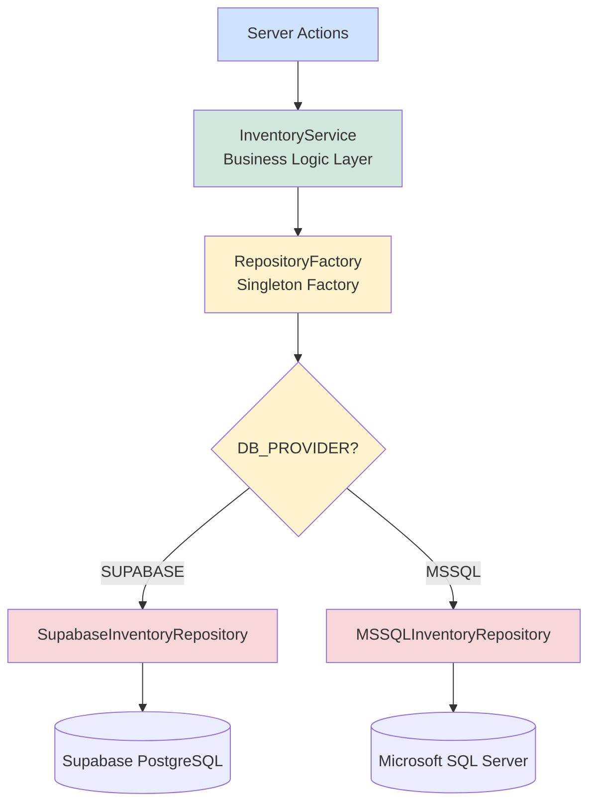

# Service Layer & Repository Factory - Complete Guide

## 📚 Overview

This document explains the **Service Layer** and **Repository Factory** implementation that sits between your Server Actions and the database repositories.

---

## 🏗️ Architecture Diagram



---

## 📁 New Files Created

| File                                                                                                                                 | Purpose                                  |
| ------------------------------------------------------------------------------------------------------------------------------------ | ---------------------------------------- |
| [`src/infrastructure/RepositoryFactory.ts`](file:///c:/Users/nteai/Desktop/project/WMSCPP/src/infrastructure/RepositoryFactory.ts)   | Singleton Factory for database selection |
| [`src/services/InventoryService.ts`](file:///c:/Users/nteai/Desktop/project/WMSCPP/src/services/InventoryService.ts)                 | Business logic layer                     |
| [`src/actions/inventory-service-actions.ts`](file:///c:/Users/nteai/Desktop/project/WMSCPP/src/actions/inventory-service-actions.ts) | Server Actions using Service Layer       |

---

## 🏭 Repository Factory

### **Purpose**

Singleton Factory pattern that automatically selects the correct database repository based on environment configuration.

### **Key Features**

✅ **Server-Side Only** - Uses `'server-only'` package to throw error if imported on client  
✅ **Singleton Pattern** - One instance per database provider  
✅ **Environment-Based** - Reads `DB_PROVIDER` from `.env`  
✅ **Multi-Database Support** - Can access both databases simultaneously  
✅ **Type-Safe** - Fully typed with TypeScript

### **Configuration**

Add to your `.env.local`:

```bash
# Primary database provider
DB_PROVIDER=SUPABASE  # or 'MSSQL'
```

### **Usage Examples**

#### **1. Basic Usage (Auto-Select from Environment)**

```typescript
import { RepositoryFactory } from '@/infrastructure/RepositoryFactory';

// Gets repository based on DB_PROVIDER env var
const repo = await RepositoryFactory.getInstance();
const products = await repo.getProducts();
```

#### **2. Force Specific Provider**

```typescript
// Force Supabase regardless of env
const supabaseRepo = await RepositoryFactory.getInstance({
  provider: 'SUPABASE',
});

// Force MSSQL regardless of env
const mssqlRepo = await RepositoryFactory.getInstance({
  provider: 'MSSQL',
});
```

#### **3. Bypass Singleton (Fresh Instance)**

```typescript
// Create new instance every time
const freshRepo = await RepositoryFactory.getInstance({
  forceNew: true,
});
```

#### **4. Multi-Database Access**

```typescript
// Get both repositories for data syncing
const supabaseRepo = await RepositoryFactory.getRepository('SUPABASE');
const mssqlRepo = await RepositoryFactory.getRepository('MSSQL');

// Sync data from ERP to main database
const erpProducts = await mssqlRepo.getProducts();
for (const product of erpProducts) {
  await supabaseRepo.updateStock(product.sku, product.qty);
}
```

---

## 🎯 Inventory Service

### **Purpose**

Service layer that encapsulates business logic and provides a clean API for inventory operations.

### **Key Features**

✅ **Business Logic Encapsulation** - Validation, calculations, and rules  
✅ **Server-Side Only** - Protected with `'server-only'`  
✅ **Repository Abstraction** - Uses RepositoryFactory internally  
✅ **Error Handling** - Comprehensive error handling  
✅ **Type-Safe Operations** - Strictly typed inputs/outputs

### **Available Methods**

#### **Product Operations**

```typescript
// Get all products
const products = await InventoryService.getAllProducts();

// Get single product
const product = await InventoryService.getProductBySku('SKU-001');

// Update stock
const result = await InventoryService.updateStock('SKU-001', 100);
```

#### **Stock Adjustment (with Reason Tracking)**

```typescript
const result = await InventoryService.adjustStock({
  sku: 'SKU-001',
  qtyChange: -10, // Negative for reduction
  reason: 'Damaged goods',
  performedBy: 'user_abc123',
});
```

#### **Stock Transfer**

```typescript
const result = await InventoryService.transferStock({
  sku: 'SKU-001',
  fromLocation: 'WH-A-01',
  toLocation: 'WH-B-05',
  qty: 50,
  performedBy: 'user_abc123',
  notes: 'Relocating for better access',
});
```

#### **Transaction History**

```typescript
const transactions = await InventoryService.getTransactionHistory('SKU-001', 100);
```

#### **Business Logic Helpers**

```typescript
// Check stock availability
const availability = await InventoryService.checkStockAvailability('SKU-001', 50);
// Returns: { available: boolean, currentQty: number, deficit?: number }

// Get low stock products
const lowStock = await InventoryService.getLowStockProducts(10); // threshold

// Get inventory summary
const summary = await InventoryService.getInventorySummary();
// Returns: { totalItems: number, totalQuantity: number }
```

#### **Advanced: ERP Sync**

```typescript
// Sync products from MSSQL to Supabase
const syncResult = await InventoryService.syncFromERP();
// Returns: { synced: number, failed: number, errors: string[] }
```

---

## Server Actions (Presentation Layer)

### **Example: Using Service Layer in Server Actions**

[`src/actions/inventory-service-actions.ts`](file:///c:/Users/nteai/Desktop/project/WMSCPP/src/actions/inventory-service-actions.ts)

```typescript
'use server';

import { InventoryService } from '@/services/InventoryService';
import { ok, fail } from '@/lib/action-utils';

export async function getProductsServiceAction() {
  try {
    const products = await InventoryService.getAllProducts();
    return ok('Products fetched successfully', { products });
  } catch (error) {
    const message = error instanceof Error ? error.message : 'Failed to fetch products';
    return fail(message);
  }
}
```

### **Usage in Components**

```typescript
// In Server Component
import { getProductsServiceAction } from '@/actions/inventory-service-actions';

export default async function InventoryPage() {
  const result = await getProductsServiceAction();

  if (!result.success) {
    return <div>Error: {result.message}</div>;
  }

  return <ProductList products={result.data.products} />;
}
```

---

## 🔄 Layer Comparison

### **Before (Direct Repository Access)**

```typescript
// ❌ Tight coupling to specific database
import { createClient } from '@/lib/supabase/server';
import { SupabaseInventoryRepository } from '@/infrastructure/repositories';

export async function getProductsAction() {
  const supabase = await createClient();
  const repo = new SupabaseInventoryRepository(supabase);
  const products = await repo.getProducts();

  // No business logic validation
  return { success: true, data: products };
}
```

### **After (Service Layer)**

```typescript
// ✅ Decoupled, configurable, with business logic
import { InventoryService } from '@/services/InventoryService';

export async function getProductsAction() {
  // Automatically uses correct database based on env
  // Includes business logic validation
  const products = await InventoryService.getAllProducts();

  return { success: true, data: products };
}
```

---

## 🎨 Design Patterns Used

### **1. Singleton Pattern** ([RepositoryFactory.ts](file:///c:/Users/nteai/Desktop/project/WMSCPP/src/infrastructure/RepositoryFactory.ts))

```typescript
// Only one instance per database provider
private static supabaseInstance: IInventoryRepository | null = null;
private static mssqlInstance: IInventoryRepository | null = null;

static async getInstance() {
  if (!this.supabaseInstance) {
    this.supabaseInstance = new SupabaseInventoryRepository(...);
  }
  return this.supabaseInstance;
}
```

**Benefits:**

- Memory efficient
- Connection pool reuse
- Consistent state

### **2. Factory Pattern** ([RepositoryFactory.ts](file:///c:/Users/nteai/Desktop/project/WMSCPP/src/infrastructure/RepositoryFactory.ts))

```typescript
static async getInstance(config?: FactoryConfig) {
  const provider = config?.provider ?? this.getProvider();

  if (provider === 'MSSQL') {
    return this.createMSSQLRepository();
  }

  return this.createSupabaseRepository();
}
```

**Benefits:**

- Runtime database selection
- Easy to add new providers
- Centralized creation logic

### **3. Service Layer Pattern** ([InventoryService.ts](file:///c:/Users/nteai/Desktop/project/WMSCPP/src/services/InventoryService.ts))

```typescript
static async adjustStock(input: StockAdjustmentInput) {
  // Business rule validation
  if (input.qtyChange < 0 && product.qty < Math.abs(input.qtyChange)) {
    return { success: false, error: 'Insufficient stock' };
  }

  // Repository call
  const repo = await RepositoryFactory.getInstance();
  return repo.updateStock(...);
}
```

**Benefits:**

- Business logic centralization
- Reusable across actions
- Easy to test

---

## 🔒 Server-Side Only Protection

Both Factory and Service use `'server-only'` package:

```typescript
import 'server-only';
```

**What happens if imported on client?**

```typescript
// In Client Component
'use client';
import { RepositoryFactory } from '@/infrastructure/RepositoryFactory';
// ❌ ERROR: This module cannot be imported from a Client Component
```

**How to use in Client Components?**

```typescript
// ✅ Call Server Action instead
'use client';
import { getProductsServiceAction } from '@/actions/inventory-service-actions';

export function ProductsClient() {
  const [products, setProducts] = useState([]);

  useEffect(() => {
    getProductsServiceAction().then(result => {
      if (result.success) setProducts(result.data.products);
    });
  }, []);

  return <div>{products.map(...)}</div>;
}
```

---

## 📊 Environment Configuration

### **Switching Databases**

**Development (.env.local):**

```bash
DB_PROVIDER=SUPABASE
```

**Production with ERP:**

```bash
DB_PROVIDER=MSSQL
```

**No restart needed** - Factory reads env on each `getInstance()` call.

---

## 🧪 Testing

### **Unit Test Example**

```typescript
import { RepositoryFactory } from '@/infrastructure/RepositoryFactory';

describe('RepositoryFactory', () => {
  beforeEach(() => {
    RepositoryFactory.reset(); // Clear singleton instances
  });

  it('should return Supabase repository by default', async () => {
    process.env.DB_PROVIDER = 'SUPABASE';
    const repo = await RepositoryFactory.getInstance();
    expect(repo).toBeInstanceOf(SupabaseInventoryRepository);
  });

  it('should return MSSQL repository when specified', async () => {
    const repo = await RepositoryFactory.getInstance({ provider: 'MSSQL' });
    expect(repo).toBeInstanceOf(MSSQLInventoryRepository);
  });
});
```

---

## 🎯 Best Practices

### ✅ **DO**

- Use InventoryService for all business logic
- Use RepositoryFactory in services, not in Server Actions directly
- Set DB_PROVIDER in environment variables
- Handle errors gracefully in Service layer
- Use type-safe inputs/outputs

### ❌ **DON'T**

- Don't create repositories directly in Server Actions
- Don't mix business logic in Server Actions
- Don't import Factory/Service in Client Components
- Don't bypass the Service layer for data access
- Don't hardcode database provider

---

## 📈 Performance Considerations

**Singleton Benefits:**

- ✅ Connection pool reuse (MSSQL)
- ✅ No repeated client initialization (Supabase)
- ✅ Memory efficient
- ✅ Faster subsequent calls

**When to use `forceNew`:**

- ⚠️ Testing scenarios
- ⚠️ Need isolated transaction
- ⚠️ Connection pool exhausted

---

## 🔗 Related Documentation

- [Repository Pattern Implementation](file:///c:/Users/nteai/Desktop/project/WMSCPP/REPOSITORY_PATTERN.md)
- [Core Entities](file:///c:/Users/nteai/Desktop/project/WMSCPP/src/core/entities)
- [Repository Interfaces](file:///c:/Users/nteai/Desktop/project/WMSCPP/src/core/interfaces)
- [Supabase Repository](file:///c:/Users/nteai/Desktop/project/WMSCPP/src/infrastructure/repositories/SupabaseInventoryRepository.ts)
- [MSSQL Repository](file:///c:/Users/nteai/Desktop/project/WMSCPP/src/infrastructure/repositories/MSSQLInventoryRepository.ts)

---

**Created:** 2026-02-04  
**Architecture:** Service Layer + Factory Pattern + Clean Architecture  
**Status:** ✅ Production Ready
